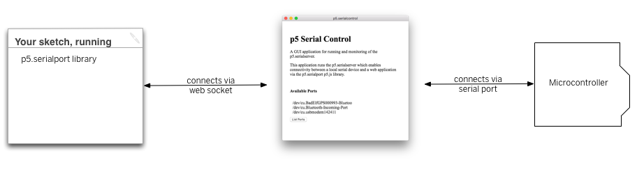

# Serial Communication with P5.js

These examples utilize the [P5 web editor](http://alpha.editor.p5js.org/)

In order for Arduino to talk to P5, you will need to install the [p5.seriacontrol](https://github.com/vanevery/p5.serialcontrol/releases) App. This little app makes our life easier by establishing communication between the serial port and the web browser. You can also run p5.serialserver in the commandline, there are notes about how to do that [here](https://itp.nyu.edu/physcomp/labs/labs-serial-communication/lab-serial-input-to-the-p5-js-ide/).

Download the P5.serialcontrol App, and keep it open in the background. The app also has a helpful debugging console that you may find useful. You can also manually open/close the serial port from the App. Usually though, you don't need to mess with this App much, just keep it running in the background whenever you're using serial communication.
