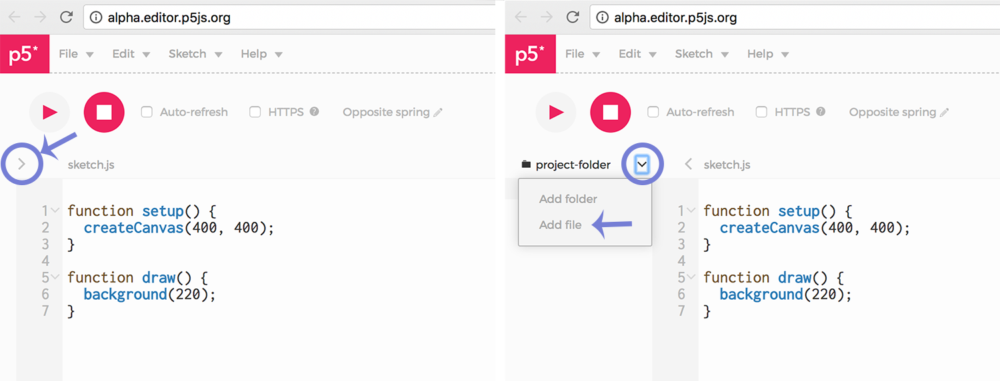

# Serial Communication with P5.js

These examples utilize the [P5 web editor](http://alpha.editor.p5js.org/)

To enable serial communication between Arduino and P5, there are two important things we need to set up:

### 1. Download the P5.serialcontrol App

First, you will need to install the [p5.seriacontrol](https://github.com/vanevery/p5.serialcontrol/releases) App. This little app makes our life easier by establishing communication between the serial port (where Arduino sends/receives data) and the web browser (where P5 lives). You can also run p5.serialserver in the commandline, there are notes about how to do that [here](https://itp.nyu.edu/physcomp/labs/labs-serial-communication/lab-serial-input-to-the-p5-js-ide/).

Once you've downloaded the P5.serialcontrol App, keep it open in the background. The app has a helpful debugging console that you may find useful, and you can also manually open/close the serial port from the App. Usually though, you don't need to mess with this App much, just keep it running in the background whenever you're using serial communication.

### 2. Include the p5.serialport.js Library in you P5 project

You will also need to download this file: [p5.serialport.js](https://raw.githubusercontent.com/vanevery/p5.serialport/master/lib/p5.serialport.js). Add it to your sketch by clicking the file navigation arrow on the left of the screen, then click the down arrow to add files. Choose the downloaded p5.serialport.js file and upload it to your sketch.

Once you've added this file, you will need to write a link to include it in your index page. In the `<head>` of the index page, after the script tags that link to the p5 library, add this line:

``

Save index.html. Now you’re ready to edit the sketch.
